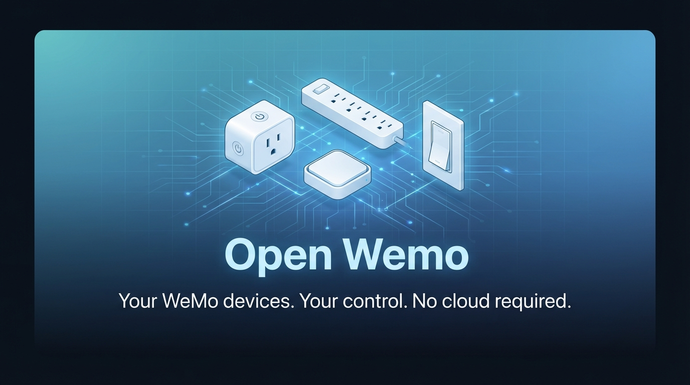

<p align="center">
  
</p>

<p align="center">
  <strong>An open-source solution for controlling Belkin WeMo smart home devices after Belkin deprecated their official app.</strong>
</p>

<p align="center">
  <a href="https://github.com/haal-laah/open-wemo/actions/workflows/ci.yml"></a>
  <a href="https://github.com/haal-laah/open-wemo/releases/latest"></a>
  <a href="https://github.com/haal-laah/open-wemo/blob/main/LICENSE"></a>
  
</p>

<p align="center">
  <a href="#quick-start-guide">Quick Start</a> •
  <a href="#features">Features</a> •
  <a href="#supported-devices">Supported Devices</a> •
  <a href="#api-reference">API</a> •
  <a href="#contributing">Contributing</a>
</p>

---

## Why Open Wemo?

Belkin has deprecated support for their WeMo smart home devices, leaving users without an official way to control their hardware. Your WeMo switches, plugs, and dimmers still work perfectly — they just need software to talk to them.

**Open Wemo gives you back control** with a lightweight desktop bridge and a mobile-friendly web app that works on any phone.

## How It Works

Open Wemo consists of two parts that work together:

```
┌─────────────────────────────────────────────────────────────┐
│  YOUR COMPUTER (always-on, runs the bridge)                 │
│  ┌─────────────────────────────────────────────────────┐    │
│  │  Open Wemo Bridge                                   │    │
│  │  • Lives in your system tray (out of the way)       │    │
│  │  • Discovers WeMo devices on your network           │    │
│  │  • Serves the mobile app to your phone              │    │
│  └─────────────────────────────────────────────────────┘    │
└─────────────────────────────────────────────────────────────┘
                            │
                            │ Wi-Fi (local network only)
                            ▼
┌─────────────────────────────────────────────────────────────┐
│  YOUR PHONE                                                 │
│  ┌─────────────────────────────────────────────────────┐    │
│  │  Open Wemo App (PWA)                                │    │
│  │  • Install once, use like a native app              │    │
│  │  • Tap to toggle devices on/off                     │    │
│  │  • View power usage for Insight devices             │    │
│  └─────────────────────────────────────────────────────┘    │
└─────────────────────────────────────────────────────────────┘
                            │
                            │ Local Network (UPnP/SOAP)
                            ▼
┌─────────────────────────────────────────────────────────────┐
│  YOUR WEMO DEVICES                                          │
│  💡 Living Room    🔌 Office Fan    💡 Bedroom Light        │
└─────────────────────────────────────────────────────────────┘
```

**Why a bridge?** Web browsers can't talk directly to WeMo devices due to security restrictions. The bridge acts as a translator between your phone and your devices.

---

## Features

| Feature | Description |
|---------|-------------|
| **Automatic Discovery** | Finds all WeMo devices on your network with one click |
| **Built-in Device Setup** | Configure new WeMo devices' WiFi — no Belkin app needed |
| **Simple Toggle Control** | Tap to turn devices on or off — instant feedback |
| **Power Monitoring** | See real-time watts and daily kWh for Insight devices |
| **Works Offline** | App shows last-known states when bridge is unreachable |
| **Dark & Light Themes** | Choose your preferred appearance, or follow system |
| **Auto-Refresh** | Device states update automatically (configurable interval) |
| **QR Code Setup** | Scan a code to instantly set up the app on any phone |
| **Cross-Platform** | Bridge runs on Windows, macOS, and Linux |
| **No Cloud Required** | Everything stays on your local network — private by design |
| **Open Source** | PolyForm NC licensed, fully transparent, community-driven |

## Supported Devices

Open Wemo works with WeMo devices that use the standard UPnP/SOAP protocol over your local network. These are the devices we've tested and confirmed working:

**Switches & Plugs**
- WeMo Switch (F7C027)
- WeMo Mini Smart Plug (F7C063, WSP070, WSP080)
- WeMo Outdoor Plug (WSP090)

**Light Switches**
- WeMo Light Switch (F7C030, F7C062)
- WeMo Smart Light Switch (WLS040)
- WeMo Smart Light Switch 3-Way (WLS0403)

**Dimmers**
- WeMo Dimmer (F7C059)
- WeMo Wi-Fi Smart Dimmer (WDS060)

**Power Monitoring**
- WeMo Insight Switch (F7C029, F7C061) — real-time watts and daily kWh

### Other WeMo Devices (Untested)

The following devices use the same protocol and **may work** with Open Wemo, but we haven't been able to test them. If you have one of these devices, let us know how it goes!

| Device | SKU | Notes |
|--------|-----|-------|
| WeMo HomeKit Bridge | F7C064 | May work for connected devices |
| WeMo Maker | F7C043 | DIY relay/sensor module |
| WeMo Motion Sensor | F7C028 | Detection only, no on/off control |

### Devices That Won't Work

These WeMo devices use different protocols (Zigbee, Thread, or proprietary) and are **not compatible** with Open Wemo:

| Device | SKU | Reason |
|--------|-----|--------|
| WeMo Link | F7C031 | Zigbee hub, different protocol |
| WeMo LED Bulbs | F7C033 | Requires WeMo Link (Zigbee) |
| WeMo Thread devices | WLS0503, WSC010, WSP100, WDC010 | Thread protocol (still work via HomeKit) |
| WeMo Appliances | F7C045, F7C046, F7C047, F7C048, F7C049, F7C050 | CrockPot, Humidifier, Heater, Air Purifier, Coffee Maker — proprietary control |
| WeMo Baby Monitor | F8J007 | Video streaming, different protocol |

**Note:** Thread-based WeMo devices (WLS0503, WSC010, WSP100, WDC010) are not affected by Belkin's shutdown and will continue to work via Apple HomeKit.

---

## Quick Start Guide

### Step 1: Download and Install the Bridge

Download the latest release for your platform from the [Releases page](https://github.com/haal-laah/open-wemo/releases):

| Platform | Download | Notes |
|----------|----------|-------|
| Windows | `open-wemo-win.exe` | Windows 10/11 (64-bit) |
| macOS (Apple Silicon) | `open-wemo-mac` | M1/M2/M3 Macs |
| macOS (Intel) | `open-wemo-mac-intel` | Older Intel Macs |
| Linux | `open-wemo-linux` | Ubuntu, Debian, Fedora, etc. |

**Run it:**
- **Windows**: Double-click the `.exe` file. If Windows Defender warns you, click "More info" → "Run anyway" (the app is safe, just not signed yet). On first run, it automatically installs itself to `%LOCALAPPDATA%\Open Wemo`.
- **macOS**: Right-click and select "Open" the first time (bypasses Gatekeeper). You may need to allow it in System Preferences → Security.
- **Linux**: Make it executable (`chmod +x open-wemo-linux`) and run it.

**What happens:**
1. The app automatically installs itself to a permanent location (Windows: AppData, macOS: ~/Applications, Linux: ~/.local/bin)
2. A small icon appears in your system tray (taskbar on Windows, menu bar on macOS)
3. A welcome window opens with a QR code for phone setup
4. The bridge starts discovering WeMo devices automatically

### Step 2: Install the Phone App

The phone app is a **Progressive Web App (PWA)** — it installs like a native app but comes from your local bridge.

**Option A: Scan the QR Code (Recommended)**

1. On the welcome window (or right-click the tray icon → "Show QR Code")
2. Scan the QR code with your phone's camera
3. Open the link in your browser
4. Follow the install prompt (see below)

**Option B: Type the URL**

If you can't scan, look at the URL shown below the QR code (like `http://192.168.1.100:3000`) and type it into your phone's browser.

**Installing on iPhone/iPad:**
1. Open the link in **Safari** (not Chrome)
2. Tap the **Share** button (square with arrow)
3. Scroll down and tap **"Add to Home Screen"**
4. Tap **"Add"** in the top right
5. The app icon appears on your home screen!

**Installing on Android:**
1. Open the link in **Chrome**
2. You'll see an **"Install"** banner at the bottom — tap it
3. Or tap the menu (⋮) → **"Install app"** or **"Add to Home Screen"**
4. The app icon appears in your app drawer!

### Step 3: Add Your Devices

**Already have WeMo devices on your network?** You're good to go! Open Wemo will discover them automatically.

1. Open the app on your phone
2. If devices aren't showing, tap the **+** button (top right)
3. The app scans your network for WeMo devices
4. Select the devices you want to add
5. Tap **"Add Selected"**

**That's it!** Tap any device to toggle it on or off.

### Step 4: Set Up New WeMo Devices (Optional)

Need to connect a brand new WeMo device to your WiFi? **You don't need the Belkin app anymore** — Open Wemo has a built-in setup wizard.

> ⚠️ **Important:** Setting up new devices requires a computer with WiFi (laptop or desktop with wireless adapter). This is only needed once per device — after setup, you can run the bridge on any computer (wired or wireless).

**How it works:**

1. Plug in your new WeMo device (it creates its own WiFi network called "WeMo.Setup.XXX")
2. In the system tray, right-click Open Wemo → **"Set Up New Device"**
3. Your computer temporarily connects to the WeMo's setup network
4. Select your home WiFi network and enter the password
5. The WeMo device joins your network and appears in the app

**Why WiFi is required:** During setup, your computer must connect directly to the WeMo device's temporary WiFi network. A wired-only PC cannot do this. Once the device is configured and on your home network, the bridge can run on any computer.

---

## Using the App

### Main Screen

When you open the app, you'll see your devices as cards:

- **Device name** — what you named it (or the WeMo default name)
- **Status** — On, Off, Standby, or Offline
- **Toggle switch** — tap to turn on/off
- **Power stats** (Insight devices only) — current watts and daily kWh

**Status colors:**
- 🟢 **Green glow** — device is ON
- ⚪ **No glow** — device is OFF
- 🟡 **Yellow** — Standby (Insight only, using minimal power)
- 🔴 **Red** — Device offline (unreachable on network)

### Header Actions

| Button | Action |
|--------|--------|
| **+** (Plus) | Discover and add new devices |
| **↻** (Refresh) | Manually refresh all device states |
| **⚙** (Settings) | Open settings panel |

### Settings

Access settings by tapping the gear icon:

- **Auto-refresh interval**: How often the app checks device states (15s, 30s, 60s, or Off)
- **Theme**: Dark, Light, or follow your System preference
- **Install/Share**: Install the app on this device or generate a QR code to share with another device
- **About**: Version info, bridge connection status, GitHub link

### Offline Mode

If the bridge becomes unreachable (computer off, network issue):

- The app shows an **"Bridge Offline"** banner
- Devices display their **last-known states** (grayed out)
- Toggle switches are disabled
- The app **automatically retries** every 10 seconds
- Once reconnected, states refresh and controls work again

---

## System Tray Menu

Right-click (or click on macOS) the tray icon for options:

| Menu Item | Description |
|-----------|-------------|
| **Open in Browser** | Opens the web app in your desktop browser |
| **Show QR Code** | Displays the QR code for phone setup |
| **Set Up New Device** | Configure a new WeMo device's WiFi (requires WiFi-capable PC) |
| **Discover Devices** | Triggers a network scan for new devices |
| **Start on Login** | Toggle auto-start when you log in (recommended) |
| **Quit** | Exits the bridge application |

**Tip:** Enable "Start on Login" so the bridge runs automatically. Your phone app will always be able to control your devices.

---

## Troubleshooting

### "No devices found" during discovery

- **Check your network**: WeMo devices and your computer must be on the same Wi-Fi network
- **Wait for devices to boot**: WeMo devices can take 30-60 seconds after power-on to respond
- **Check device connectivity**: Make sure the LED on your WeMo device is solid (not blinking)
- **Firewall**: Ensure your firewall allows UDP port 1900 (for device discovery) and the bridge port (default 3000)

### Device shows "Offline"

- **Device might be unplugged**: Check the physical device
- **IP address changed**: Try running discovery again to find the new address
- **Network congestion**: WeMo devices can be slow to respond on busy networks
- **Device hung**: Unplug the WeMo device for 10 seconds and plug it back in

### Can't install the app on phone

- **iPhone**: You must use **Safari**. Chrome/Firefox on iOS don't support "Add to Home Screen"
- **Android**: Use **Chrome**. Other browsers may not show the install prompt
- **Same network required**: Your phone must be on the same Wi-Fi as the bridge
- **Try typing the URL**: If QR code doesn't work, manually type the URL shown

### Bridge won't start

- **Port conflict**: Another app might be using port 3000. The bridge will show an error.
- **Antivirus blocking**: Some antivirus software blocks unknown executables. Add an exception.
- **macOS Gatekeeper**: Right-click → Open the first time, or allow in Security preferences.

### Power monitoring shows wrong values

- **Give it time**: Insight devices average power over time; readings stabilize after a few minutes
- **Standby mode**: Very low power (< 1 watt) shows as "Standby" state
- **Device firmware**: Older WeMo firmware may report slightly different formats

---

## Privacy & Security

Open Wemo is designed with privacy in mind:

- **100% Local**: All communication happens on your local network
- **No Cloud**: Your device data never leaves your home
- **No Account**: No sign-up, no login, no tracking
- **No Internet Required**: Works even if your internet is down (as long as local network works)
- **Open Source**: You can inspect every line of code

The bridge binds to your local network IP only, not to all interfaces. This means it's only accessible from devices on your home network.

---

## Building from Source

### Prerequisites

- [Bun](https://bun.sh/) v1.0 or later

### Development

```bash
# Clone the repository
git clone https://github.com/haal-laah/open-wemo.git
cd open-wemo

# Install dependencies
bun install

# Start development server (bridge + hot reload)
bun run dev
```

The bridge starts on `http://localhost:3000`. Open this URL in a browser to test the web app.

### Production Build

```bash
# Build for your current platform
bun run build

# Build for a specific platform
bun run build:windows   # Windows x64
bun run build:mac       # macOS ARM64 (Apple Silicon)
bun run build:mac-intel # macOS x64 (Intel)
bun run build:linux     # Linux x64

# Build for all platforms
bun run build:all
```

Output files appear in `packages/bridge/dist/`.

### Running Tests

```bash
bun run test
```

### Code Quality

```bash
# Check for lint errors
bun run lint

# Auto-fix lint errors
bun run lint:fix

# Format code
bun run format

# Type check
bun run typecheck
```

---

## Project Structure

```
open-wemo/
├── packages/
│   ├── bridge/              # Desktop tray app + REST API
│   │   └── src/
│   │       ├── main.ts      # Application entry point
│   │       ├── server/      # Hono HTTP server & routes
│   │       ├── wemo/        # WeMo protocol (SSDP, SOAP)
│   │       ├── tray/        # System tray & welcome window
│   │       └── db/          # SQLite database
│   │
│   └── web/                 # PWA frontend
│       ├── index.html       # Single-page app
│       ├── manifest.json    # PWA manifest
│       ├── sw.js            # Service worker
│       ├── css/style.css    # Styles
│       └── js/app.js        # Application logic
│
├── docs/                    # Documentation
│   ├── API.md              # REST API reference
│   ├── PROTOCOL.md         # WeMo protocol details
│   └── ARCHITECTURE.md     # System design
│
├── scripts/                 # Build scripts
└── reference-codebase/      # Original Python implementation (for reference)
```

---

## Technology Stack

| Component | Technology | Why |
|-----------|------------|-----|
| Runtime | [Bun](https://bun.sh/) | Fast, compiles to single executable |
| Language | TypeScript | Type safety, better developer experience |
| HTTP Server | [Hono](https://hono.dev/) | Lightweight, fast, excellent DX |
| Database | SQLite (bun:sqlite) | Zero-config, embedded, reliable |
| System Tray | [systray2](https://github.com/nicholasdickey/systray2) | Cross-platform, lightweight |
| Frontend | Vanilla JS + CSS | No build step, fast, simple |
| PWA | Service Worker | Installable, works offline |

---

## API Reference

The bridge exposes a REST API that the PWA uses (and you can use for automation):

| Endpoint | Method | Description |
|----------|--------|-------------|
| `/api/devices` | GET | List all saved devices |
| `/api/devices?includeState=true` | GET | List devices with current states |
| `/api/devices/:id` | GET | Get single device with state |
| `/api/devices` | POST | Add/update a device |
| `/api/devices/:id` | DELETE | Remove a device |
| `/api/devices/:id/on` | POST | Turn device on |
| `/api/devices/:id/off` | POST | Turn device off |
| `/api/devices/:id/toggle` | POST | Toggle device state |
| `/api/devices/:id/insight` | GET | Get power data (Insight only) |
| `/api/discover` | GET | Scan network for devices |
| `/api/health` | GET | Check if bridge is running |

See [docs/API.md](docs/API.md) for full documentation with examples.

---

## Contributing

Contributions are welcome! Please see [CONTRIBUTING.md](CONTRIBUTING.md) for guidelines.

---

## License

[PolyForm Noncommercial 1.0.0](LICENSE) — free for personal and non-commercial use. Commercial use is not permitted.

---

## Acknowledgments

- [pywemo](https://github.com/pywemo/pywemo) — Python WeMo library that informed our protocol implementation
- [wemo-client](https://github.com/timonreinhard/wemo-client) — Node.js WeMo client reference
- The WeMo community for reverse-engineering the protocol

---

## FAQ

**Q: Does this work without internet?**  
A: Yes! Everything runs on your local network. No cloud, no internet required.

**Q: Can I control devices away from home?**  
A: Not currently. Open Wemo is local-only by design. For remote access, you'd need a VPN or similar solution.

**Q: Will this work with new WeMo devices?**  
A: It should work with any WeMo device that uses the standard UPnP/SOAP protocol. Most WeMo devices do.

**Q: Can multiple phones control the same devices?**  
A: Yes! Any device on your network can access the bridge. Just scan the QR code on each phone.

**Q: Does the bridge need to run 24/7?**  
A: Only when you want to control devices. Enable "Start on Login" so it runs automatically when your computer is on.

**Q: What if my computer goes to sleep?**  
A: The phone app will show "Bridge Offline" and disable controls. It reconnects automatically when your computer wakes up.

**Q: Is this secure?**  
A: The bridge only listens on your local network — it's not accessible from the internet. Your WeMo devices use the same local-only security model.

**Q: Do I need the Belkin app to set up new devices?**  
A: No! Open Wemo includes a built-in setup wizard. Just plug in your new WeMo device, and use the "Set Up New Device" option in the system tray menu.

**Q: Why do I need a WiFi-capable computer for device setup?**  
A: New WeMo devices create their own WiFi network ("WeMo.Setup.XXX") that your computer must connect to directly. This is only required once per device — after setup, you can run the bridge on any computer, wired or wireless.

**Q: I already have WeMo devices on my network. Do I need to do anything special?**  
A: Nope! Just install the bridge and it will automatically discover your existing devices. The setup wizard is only for brand new devices that haven't been connected to WiFi yet.
